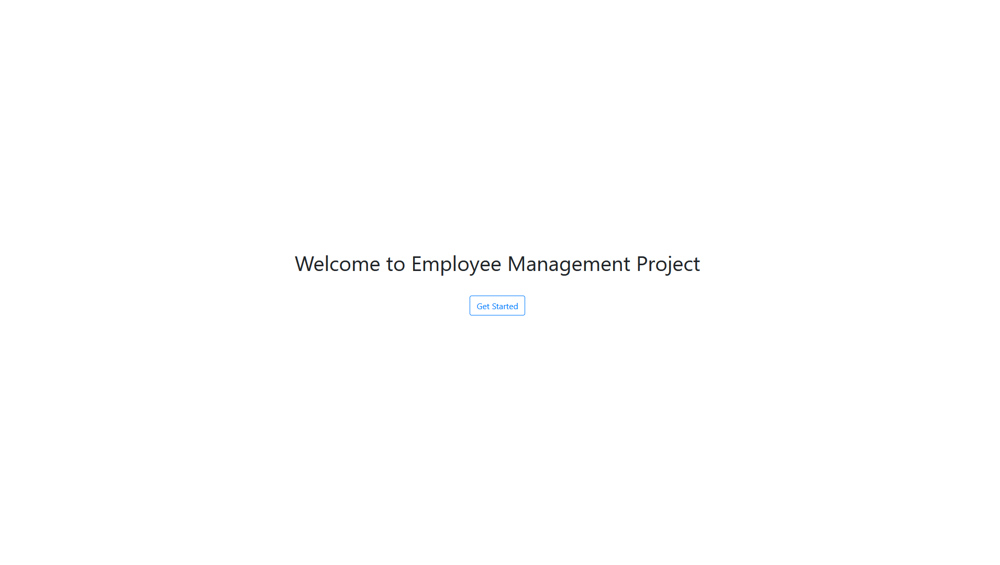
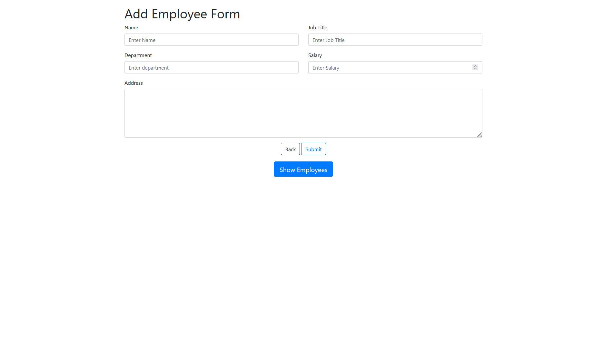
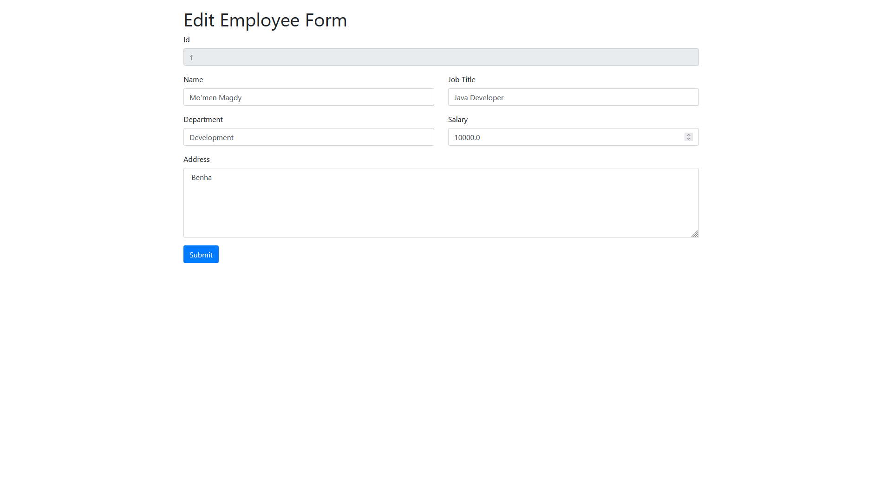

# Employee-Management-project

This is simple Spring application for Employee Management created using Spring MVC and Hibernate.

###  Technologies Used:
- Spring MVC.
- MySQL.
- Hibernate (CRUD Operations).
- JSP & XML.

---

## Screenshots

#### Home page

#### Add Employee Form

#### Show Employees

#### Edit Employee Form

